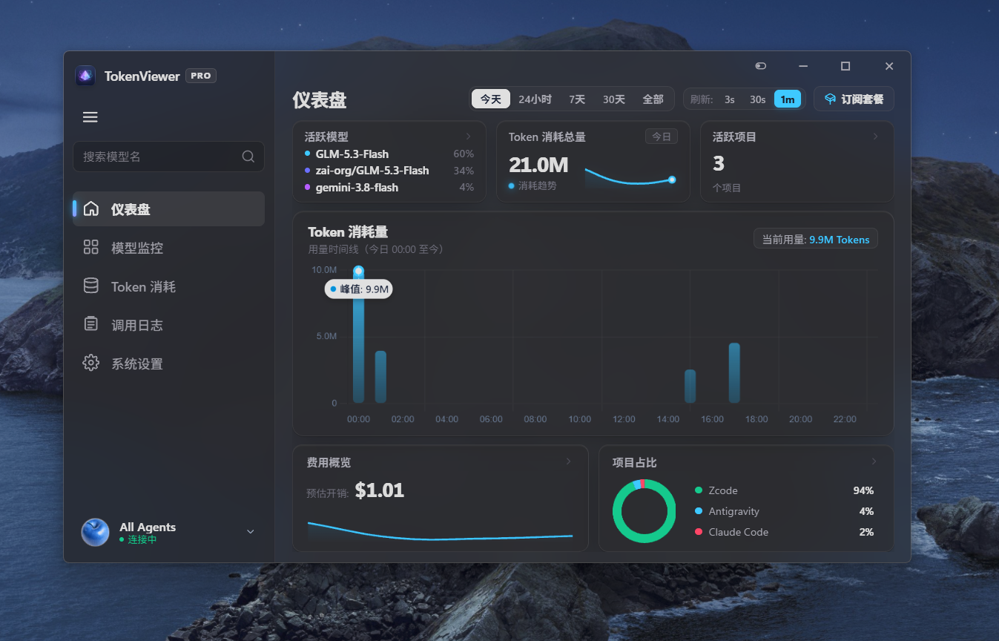
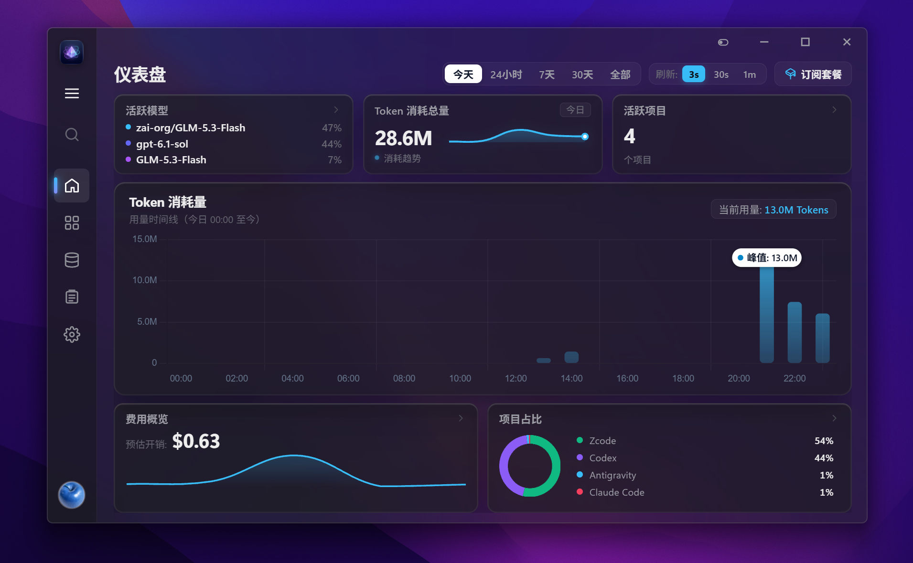

# TokenViewer Pro

<p align="left">
  <b>English</b> | <a href="README_zh.md">简体中文</a>
</p>

A frosted-glass desktop dashboard that shows real-time **token usage and cost** across local AI coding agents — Codex CLI, Claude Code, ZCode, Pi, and Antigravity — in one macOS / Vision Pro style glass widget.

<p align="center">
  
  
</p>

## Highlights

- **Five agents, one dashboard** — parses each agent's local session logs / databases and unifies them into a single event stream.
- **Live monitoring** — background scanner picks up new usage within seconds; a breathing indicator shows active models in the last 10 seconds.
- **Cost analytics** — per-model pricing table (USD per million tokens, editable in UI), cache-aware cost breakdown (fresh input / cache read / cache write / output).
- **Cache hit rate** — cache-normalized hit rate per model, so you can actually see how well prompt caching is working.
- **Time ranges** — today / 24h / 7d / 30d / all, with hourly or daily trend chart and peak markers.
- **Project breakdown** — donut chart of token share per agent; session list with working directories.
- **Bilingual UI** — Simplified Chinese / English, switchable at runtime.
- **Light / dark theme** — follows the system automatically (reads the Windows registry so WebView2 stays in sync).
- **Auto-recovering Acrylic & Liquid Glass** — combines Windows 11 DWM focus auto-recovery with an Apple Liquid Glass ambient mesh backdrop, eliminating flat solid gray fallbacks on focus loss.

## Supported agents & data sources

All data is **read-only**. TokenViewer never writes to or deletes the agent's own logs.

| Agent | Reads from |
|---|---|
| Codex CLI | `~/.codex/sessions/` and `~/.codex/archived_sessions/` (rollout JSONL) |
| Claude Code | `~/.claude/projects/**/*.jsonl` |
| ZCode | `~/.zcode/cli/db/db.sqlite` (`model_usage` table) |
| Pi | `~/.pi/agent/sessions/**/*.jsonl` |
| Antigravity | `~/.gemini/antigravity/conversations/*.db` |

It also keeps its own aggregated store at `~/.codex/token_viewer.db` (SQLite, WAL) for fast queries and history.

## Privacy

- The web server binds to **127.0.0.1 only** and rejects requests whose `Host` header is not loopback (guards against DNS rebinding), so other pages/browser tabs cannot read your data.
- Nothing is uploaded anywhere. All parsing, aggregation, and rendering happen on your machine.

## Install & run

Requirements: **Python 3.11+** (tested on 3.13), Windows (the tray icon and window controls use Win32 APIs; the dashboard itself works in any browser).

```bash
git clone https://github.com/XHH6298/token-viewer-pro.git
cd token-viewer-pro
pip install -r requirements.txt
python app.py
```

A glass widget window opens. If WebView2 is unavailable, the app automatically falls back to your default browser at `http://127.0.0.1:<port>`.

### Build a standalone exe (optional)

```powershell
.\package.ps1
```

This runs PyInstaller (onedir) and outputs `dist\TokenViewerPro\TokenViewerPro.exe`, then recreates desktop / Start-menu shortcuts via `make_shortcut.ps1`.

## Configuration

Environment variables (all optional):

| Variable | Default | Purpose |
|---|---|---|
| `TOKEN_VIEWER_DB` | `~/.codex/token_viewer.db` | Location of the app's own SQLite store |
| `TOKEN_VIEWER_LOG` | `~/.codex/token_viewer.log` | App log file |
| `TOKEN_VIEWER_BACKDROP` | `3` (Acrylic) | Windows 11 backdrop material: `3` for Acrylic, `4` for Mica Alt (persistent wallpaper tint) |

## Tests

```bash
python test_core.py
```

Covers the parsing adapters, token semantics per agent (Anthropic-style vs OpenAI-style cache accounting), cost computation, and the dedup/idempotency logic that keeps a full re-scan from double-counting events.

## Tech notes

- **Backend**: FastAPI + uvicorn (threaded), SQLite storage layer with schema migrations.
- **Dedup**: events are keyed by `(agent_type, session_id, turn_id)` with a field-fingerprint fallback for events lacking a turn id, plus stream-chunk dedup for Claude's multi-line assistant messages — full re-scans are idempotent (`INSERT OR IGNORE`).
- **Semantic correctness**: Codex/ZCode/Pi report `input_tokens` **including** cache reads (OpenAI semantics), while Claude/Antigravity report fresh input separately (Anthropic semantics). Token & cost math branches on agent accordingly.
- **Frontend**: vanilla JS + Chart.js v4 (vendored, MIT), frosted-glass CSS with light/dark variables; canvas charts re-read CSS variables on theme change.

## License

[MIT](LICENSE)
